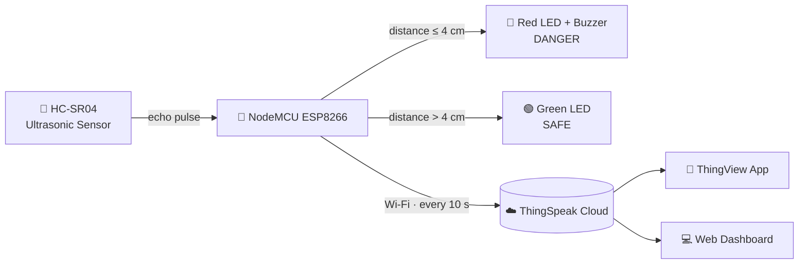

<h1 align="center">🌊 IoT-Based Flood Monitoring System</h1>

<p align="center">
  A real-time, Wi-Fi-enabled flood early-warning prototype built on the <b>NodeMCU ESP8266</b> —
  measuring water levels with an ultrasonic sensor and pushing live data to the cloud for
  on-site and remote monitoring.
</p>

<p align="center">
  
  
  
  
  
</p>

---

## 🎥 Demo Video

> **Watch the full project demonstration on YouTube:**
>
> ▶️ **https://youtu.be/2VsXdPczwvM**

The video walks through the hardware build, live water-level detection, LED/buzzer alerts, and cloud monitoring via the ThingView mobile app.

---

## 📑 Table of Contents

- [Overview](#-overview)
- [Key Features](#-key-features)
- [System Architecture](#-system-architecture)
- [Hardware Components](#-hardware-components)
- [Circuit & Pin Configuration](#-circuit--pin-configuration)
- [Software & Libraries](#-software--libraries)
- [How It Works](#-how-it-works)
- [Getting Started](#-getting-started)
- [Alert Logic](#-alert-logic)
- [Repository Structure](#-repository-structure)
- [Author](#-author)
- [Acknowledgements](#-acknowledgements)

---

## 📖 Overview

Flooding is one of Malaysia's most frequent and damaging natural disasters. This project was developed after a heavy thunderstorm flooded the field of **Kolej Profesional MARA Beranang (KPMB)** in June 2023 — water that could easily flow down to the guardhouse (the campus's lowest point) and the nearby student car park.

The **IoT-Based Flood Monitoring System** provides a low-cost early-warning solution. An ultrasonic sensor continuously measures the distance to the water surface. As the water rises, the distance shrinks — and once it crosses a critical threshold, the system triggers **local alerts** (LED + buzzer) and simultaneously logs the reading to the **ThingSpeak IoT cloud**, so it can be monitored in real time from anywhere in the world.

---

## ✨ Key Features

- 📏 **Real-time water-level sensing** using an ultrasonic time-of-flight sensor (HC-SR04).
- 🚨 **Dual-mode on-site alerts** — green LED for *safe*, red LED + buzzer for *danger*.
- ☁️ **Cloud logging** to ThingSpeak every 10 seconds over Wi-Fi.
- 📱 **Remote monitoring** via the ThingView mobile app and a ThingSpeak web dashboard with live `SAFE` / `DANGER` lamp indicators.
- 🔋 **Portable & wireless** — powered by a power bank through a USB Micro-B cable.
- 🛠️ **Configurable threshold** — the danger trigger distance can be tuned in a single line of code.

---

## 🏗️ System Architecture



**Flow:** The ultrasonic sensor emits a pulse and measures how long the echo takes to return. The NodeMCU converts this into a distance (water level), decides the alert state, drives the LEDs/buzzer, and uploads the value to ThingSpeak — where a green *SAFE* lamp or red *DANGER* lamp is shown to remote users.

---

## 🔩 Hardware Components

| #  | Component                                   | Qty | Purpose                                   |
|----|---------------------------------------------|-----|-------------------------------------------|
| 1  | NodeMCU ESP8266 (ESP-12E)                   | 1   | Wi-Fi microcontroller & data processing   |
| 2  | Ultrasonic Sensor HC-SR04                   | 1   | Measures distance to the water surface    |
| 3  | Passive Buzzer Module                       | 1   | Audible danger alarm                      |
| 4  | LED 5 mm (Red & Green)                      | 2   | Visual status indicators                  |
| 5  | MB102 Breadboard (830 holes)                | 1   | Prototyping board                         |
| 6  | Jumper Wires (Male-to-Male, Female-to-Male) | —   | Connections                               |
| 7  | USB Micro-B Cable                           | 1   | Power & code upload                       |

---

## 🔌 Circuit & Pin Configuration

| Component            | Component Pin | → | NodeMCU Pin |
|----------------------|---------------|---|-------------|
| Ultrasonic HC-SR04   | VCC           | → | `VIN`       |
| Ultrasonic HC-SR04   | Trig          | → | `D1`        |
| Ultrasonic HC-SR04   | Echo          | → | `D2`        |
| Ultrasonic HC-SR04   | GND           | → | `GND`       |
| Red LED (Danger)     | Anode (+)     | → | `D3`        |
| Green LED (Safe)     | Anode (+)     | → | `D4`        |
| Passive Buzzer       | Signal (+)    | → | `D5`        |

> 💡 Remember to share a common **GND** rail between the NodeMCU, LEDs, and buzzer on the breadboard.

---

## 💻 Software & Libraries

- **Arduino IDE** (v1.8.19 or newer)
- **ESP8266 Board Package** — added via *Boards Manager*
  - Board Manager URL: `https://arduino.esp8266.com/stable/package_esp8266com_index.json`
  - Board: **NodeMCU 1.0 (ESP-12E Module)**
- **Libraries:**
  - [`ThingSpeak`](https://www.arduino.cc/reference/en/libraries/thingspeak/) by MathWorks
  - `ESP8266WiFi` (bundled with the ESP8266 board package)
- **Cloud:** [ThingSpeak IoT Platform](https://thingspeak.com/)
- **Mobile:** *ThingView – ThingSpeak viewer* (Android)

---

## ⚙️ How It Works

1. **Measure** — The HC-SR04 sends a 10 µs trigger pulse and reads the echo. Distance is calculated using the speed of sound:
   ```cpp
   distance1 = duration1 * 0.034 / 2;   // result in centimetres
   ```
2. **Decide** — A smaller distance means a *higher* water level. If the distance drops to the danger threshold (`≤ 4 cm` by default), the system enters **DANGER** mode; otherwise it stays **SAFE**.
3. **Alert** — In DANGER mode the **red LED** lights up and the **buzzer** sounds; in SAFE mode the **green LED** stays on.
4. **Upload** — Every **10 seconds**, the water-level reading is pushed to a ThingSpeak channel, updating the live chart and the `SAFE` / `DANGER` cloud indicators.

---

## 🚀 Getting Started

### 1. Set up the Arduino IDE for ESP8266
- Open **File → Preferences**, and paste the ESP8266 Board Manager URL (above) into *Additional Boards Manager URLs*.
- Go to **Tools → Board → Boards Manager**, search **ESP8266**, and install it.
- Select **Tools → Board → NodeMCU 1.0 (ESP-12E Module)** and choose the correct **Port**.

### 2. Install the ThingSpeak library
- **Sketch → Include Library → Manage Libraries**, search **ThingSpeak**, and click *Install*.

### 3. Configure your credentials
Open `flood_monitoring.ino` and replace the placeholders with your own values:
```cpp
unsigned long ch_no      = 1772692;                 // Your ThingSpeak Channel ID
const char *  write_api  = "YOUR_WRITE_API_KEY";    // Your ThingSpeak Write API Key
char auth[]              = "YOUR_CHANNEL_AUTHOR_KEY";
char ssid[]             = "YOUR_WIFI_SSID";
char pass[]             = "YOUR_WIFI_PASSWORD";
```

### 4. (Optional) Tune the danger threshold
```cpp
if (distance1 <= 4) {   // change 4 (cm) to suit your deployment
```

### 5. Upload & run
- Connect the NodeMCU via USB Micro-B, click **Upload**, then open the **Serial Monitor** at **115200 baud** to view live readings.
- Add your channel in the **ThingView** app (enter your Channel ID) to monitor remotely.

---

## 🚦 Alert Logic

| Water Level (distance to sensor) | Zone     | 🔴 Red LED | 🟢 Green LED | 🔊 Buzzer   | ☁️ ThingSpeak |
|----------------------------------|----------|-----------|-------------|-------------|---------------|
| `> 4 cm`                         | **SAFE**   | OFF       | ON          | OFF         | logs value    |
| `≤ 4 cm`                         | **DANGER** | ON        | OFF         | ON (300 Hz) | logs value    |

> Smaller distance = higher water = greater flood risk.

---

## 📂 Repository Structure

```
IoT-Flood-Monitoring-System/
├── flood_monitoring.ino     # Main Arduino sketch (ESP8266)
├── README.md                # Project documentation (this file)
└── docs/                    # (optional) report PDF, circuit diagram, photos
```

---

## 👩‍💻 Author

**Aisyah Aina Sufia Hilman**
Diploma in Computer Science, Kolej Profesional MARA Beranang (2023/2024)


---

## 🙏 Acknowledgements

- **Kolej Profesional MARA Beranang (KPMB)** — Quantitative Science Department
- Project supervisor & mentors for guidance throughout the IoT module
- [MathWorks ThingSpeak](https://thingspeak.com/) & the ESP8266 open-source community

---

<p align="center"><i>Built to keep people — and their cars — one step ahead of the flood. 🌧️🛡️</i></p>
